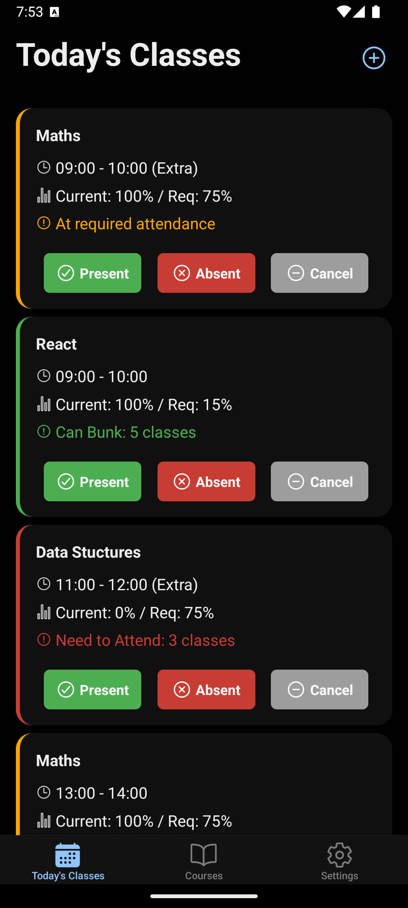
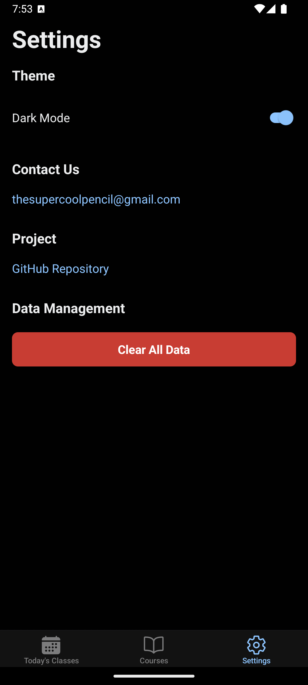

# GRAD 👋
**GRAD** (Grades, Reports, Attendance Dashboard) is a lightweight mobile app that helps students track their internal marks and attendance with simplicity and clarity.

This project is built with [Expo](https://expo.dev) and was bootstrapped using [`create-expo-app`](https://www.npmjs.com/package/create-expo-app).

---

## 🚀 Getting Started

### 1. Install Dependencies

```bash
npm install
```

```bash
npx expo start
```

## 🐞 Known Bugs to Fix in v0.1.0

- Improve the design of the course information page to resolve usability issues.
- Add a distinctive app logo and name to address branding inconsistencies.
- Fix daily attendance logging and ensure it displays correctly on the course information page.
- Resolve issues with the dark mode toggle in the settings.

## 📸 Demo Screenshots


 