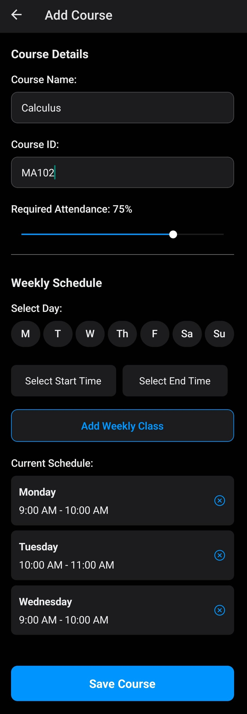
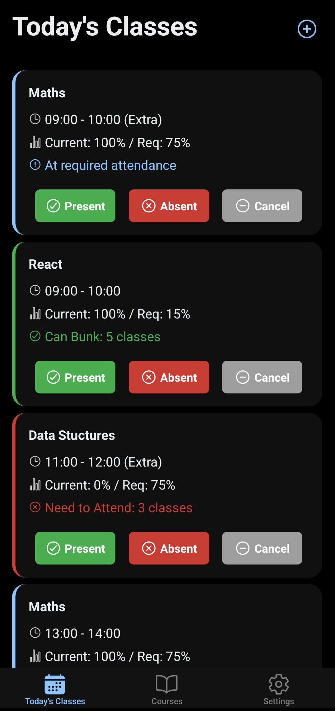
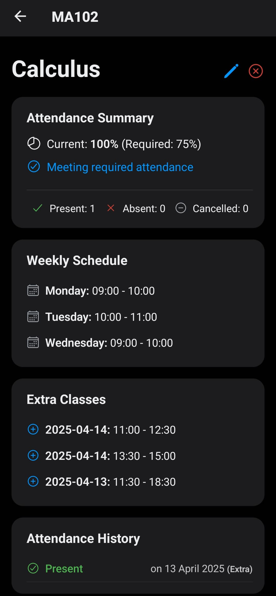
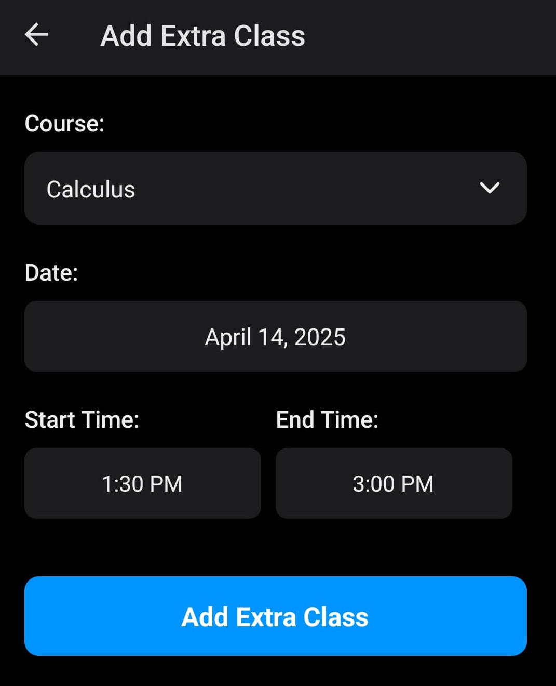
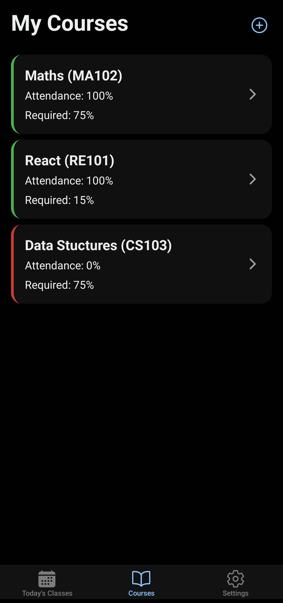
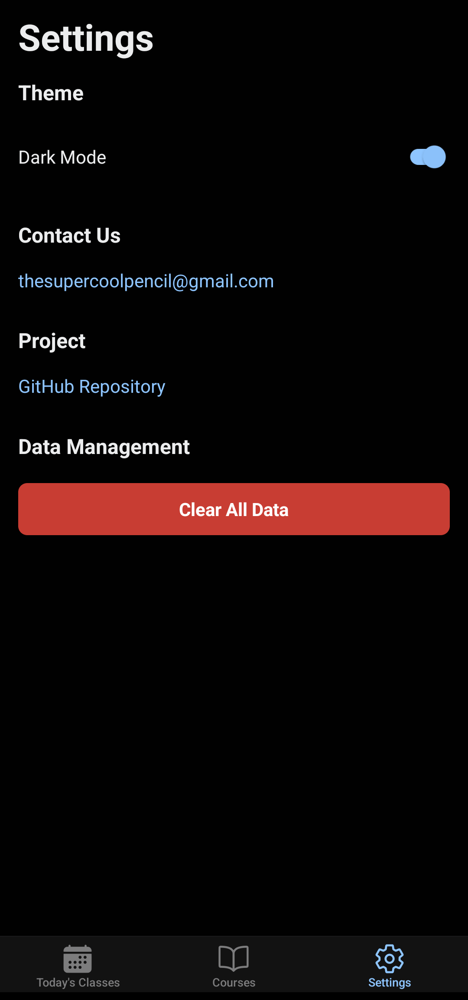

# GRAD 👋
**GRAD** (Grades, Reports, Attendance Dashboard) is a lightweight mobile app that helps students track their internal marks and attendance with simplicity and clarity.

This project is built with [Expo](https://expo.dev) and was bootstrapped using [`create-expo-app`](https://www.npmjs.com/package/create-expo-app).

---

## 🚀 Getting Started

1. **Install Dependencies**  
   ```bash
   npm install
   ```

2. **Run the App**  
   ```bash
   npx expo start
   ```
   This will start the Expo development server, allowing you to test on a connected device or an emulator.

Or simply download the latest APK from the [Releases](https://github.com/SuperCoolPencil/GRAD/releases) page.

---

## Features

- **Course Management**: Add and remove courses with required attendance thresholds.
- **Attendance Tracking**: Mark your presence or absence and track real-time attendance percentages.
- **Extra Classes**: Easily schedule additional sessions outside your regular timetable.
- **Simple UI**: Designed for quick updates and at-a-glance progress checks.

---

## Upcoming Features

- **Scheduled Notificatications**
- **Google Calendar Integration**
- **Marks Tracker**
- **Grades Predictor**
- **CLEO Integration**

---

## Screenshots

<table>
  <tr>
    <td align="center"></td>
    <td align="center"></td>
  </tr>
  <tr>
    <td align="center"></td>
    <td align="center"></td>
  </tr>
  <tr>
    <td align="center"></td>
    <td align="center"></td>
  </tr>
</table>

---

## License

This project is licensed under the [MIT License](LICENSE).