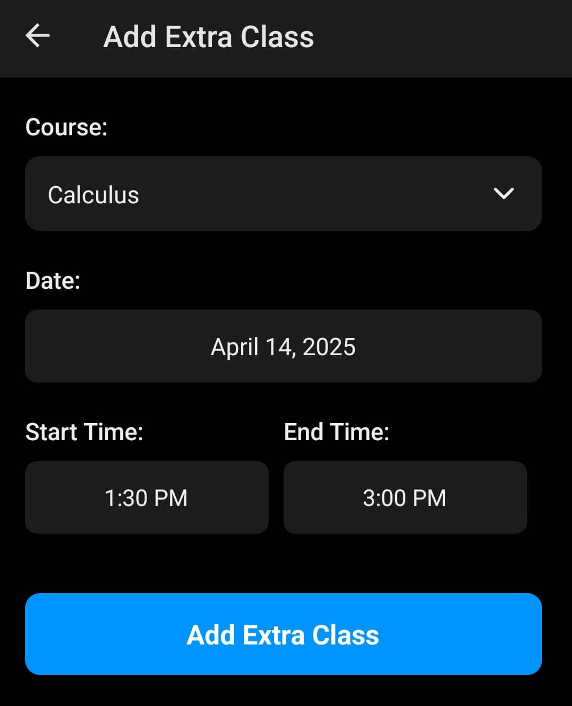
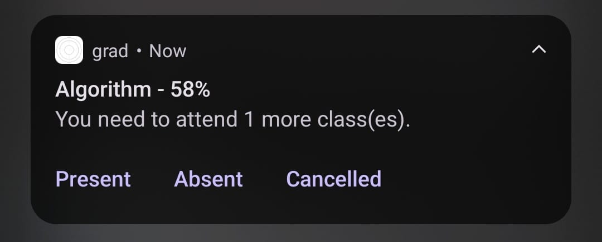

# GRAD 
**GRAD** (Grades, Reports, Attendance Dashboard) is a lightweight mobile app that helps students track their internal marks and attendance with simplicity and clarity.

This project is built with [Expo](https://expo.dev) and was bootstrapped using [`create-expo-app`](https://www.npmjs.com/package/create-expo-app).

---

## 🚀 Getting Started

1. **Install Dependencies**  
   ```bash
   npm install
   ```

2. **Run the App**  
   ```bash
   npx expo start
   ```
   This will start the Expo development server, allowing you to test on a connected device or an emulator.

Or simply download the latest APK from the [Releases](https://github.com/SuperCoolPencil/GRAD/releases) page.

---

## Features

- **Course Management**
- **Attendance Tracking**
- **Scheduled Notifications**
- **Analytics Tab**
- **Extra Classes**
- **Dark Theme**
  
---

## Screenshots

<table>
   <tr>
      <td align="center"></td>
      <td align="center"></td>
   </tr>
  <tr>
    <td align="center"></td>
    <td align="center"></td>
  </tr>
  <tr>
    <td align="center"></td>
    <td align="center"></td>
  </tr>
   <tr>
      <td align="center"></td>
      <td align="center"></td>
   </tr>
  <tr>
    <td align="center"></td>
    <td align="center"></td>
  </tr>
</table>

---

## License

This project is licensed under the [MIT License](LICENSE).
